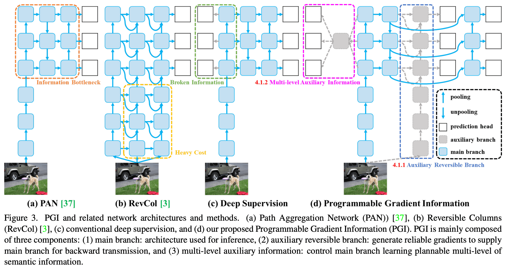
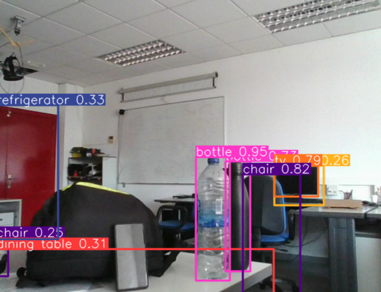
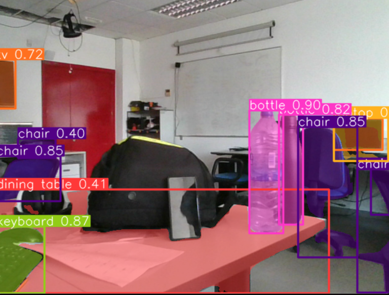

# YOLOv9 applications showcase
Using YOLOv9 along with cutting-edge machine learning frameworks such as Ultralytics, PyTorch, TensorFlow, and OpenCV, and utilizing NVIDIA's CUDA for accelerated computing, to explore various applications including object detection, image segmentation, and real-time video analysis.


## Overview and Background

## Table of Contents

## Getting started

### Resources used
A high-performance laptop equipped with an Intel Core i7-13620H CPU and a powerful NVIDIA GeForce RTX 4060 Laptop GPU (3,072 CUDA cores, 32GB RAM) graphic card has been used. This robust system efficiently managed the computation required for testing. The combination of these advanced hardware components and state-of-the-art software frameworks ensures smooth and efficient execution of deep learning models and algorithms, enabling detailed exploration and implementation of YOLOv9 for various practical applications. 

### Installing
The project is deployed in a local machine, so you need to install the next software and dependencies to start working:

1. Create and activate the new virtual environment for the project

```bash
conda create --name yolov9_applications
conda activate yolov9_applications
```

2. Clone repository

```bash
git clone https://github.com/rafamartinezquiles/yolov9-applications-showcase.git
```

3. In the same folder that the requirements are, install the necessary requirements

```bash
pip install -r requirements.txt
```

### Setup


## Object Detection
Object detection is a computer vision technique used to identify and locate objects within an image or video. This powerful capability is a critical component in various applications, including autonomous driving, surveillance, retail analytics, and more. By leveraging advanced algorithms and deep learning models, object detection systems can recognize multiple objects, classify them, and determine their precise locations within the visual frame. The arguments to be specified are:
- **--video:** Path to the input video file or camera index (default is 0 for the first webcam).
- **--model:** YOLOv9 model file (e.g., yolov9t.pt, yolov9s.pt, yolov9m.pt, yolov9c.pt, yolov9e.pt).

```bash
python src/yolov9_object_detection.py -v path/to/your/video.mp4 -m yolov9e.pt
```
When you have performed the corresponding test, you can close the additional tab by pressing the q key to prevent the tab from collapsing.


## Instance Segmentation
Instance segmentation is an advanced computer vision technique that extends the capabilities of object detection by not only identifying and locating objects within an image or video but also distinguishing between individual instances of the same object class. This means that instance segmentation not only detects objects but also segments them pixel by pixel, assigning each pixel in the image to a specific object instance. This technique is incredibly useful in various applications, particularly in scenarios where precise object delineation is crucial, such as medical imaging, autonomous driving, and industrial quality control. By providing detailed object boundaries and segmentation masks, instance segmentation enables more accurate analysis, tracking, and understanding of visual scenes. The arguments to be specified are:
- **--video:** Path to the input video file or camera index (default is 0 for the first webcam).
- **--model:** YOLOv9 model file (e.g., yolov9t-seg.pt, yolov9s-seg.pt, yolov9m-seg.pt, yolov9c-seg.pt, yolov9e-seg.pt).

```bash
python src/yolov9_instance_segmentation.py -v path/to/your/video.mp4 -m yolov9e-seg.pt
```

When you have performed the corresponding test, you can close the additional tab by pressing the q key to prevent the tab from collapsing.


## References
- OpenCV: https://opencv.org/
- Ultralytics: https://github.com/ultralytics/ultralytics
- Chien-Yao Wang and Hong-Yuan Mark Liao. YOLOv9: Learning What You Want to Learn Using Programmable Gradient Information. In arXiv preprint arXiv:2402.13616, 2024.
